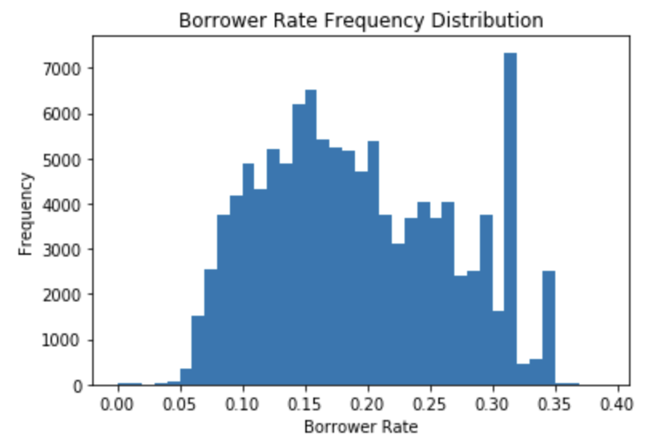
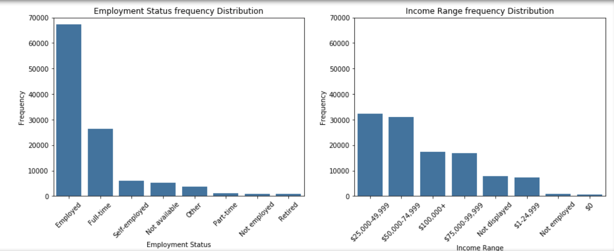
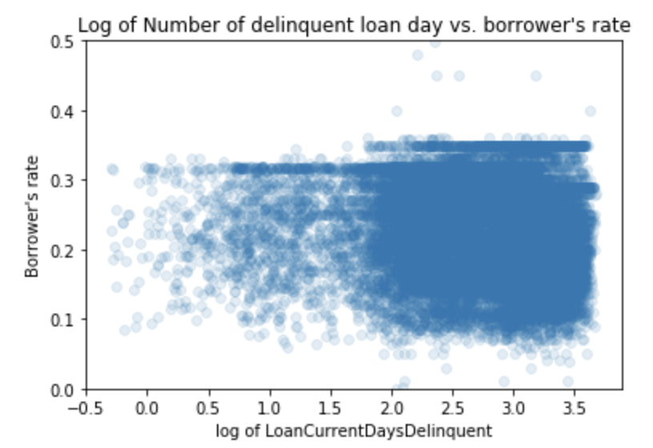
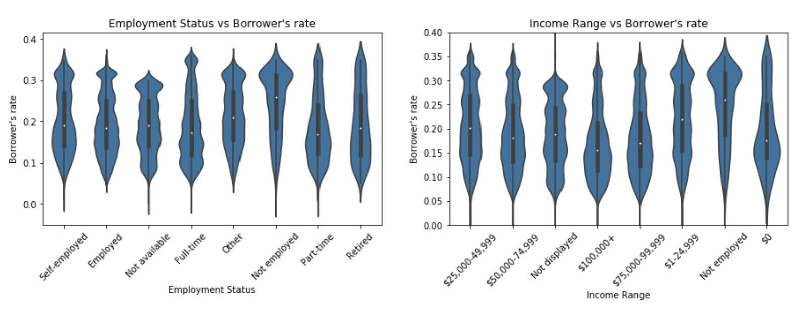
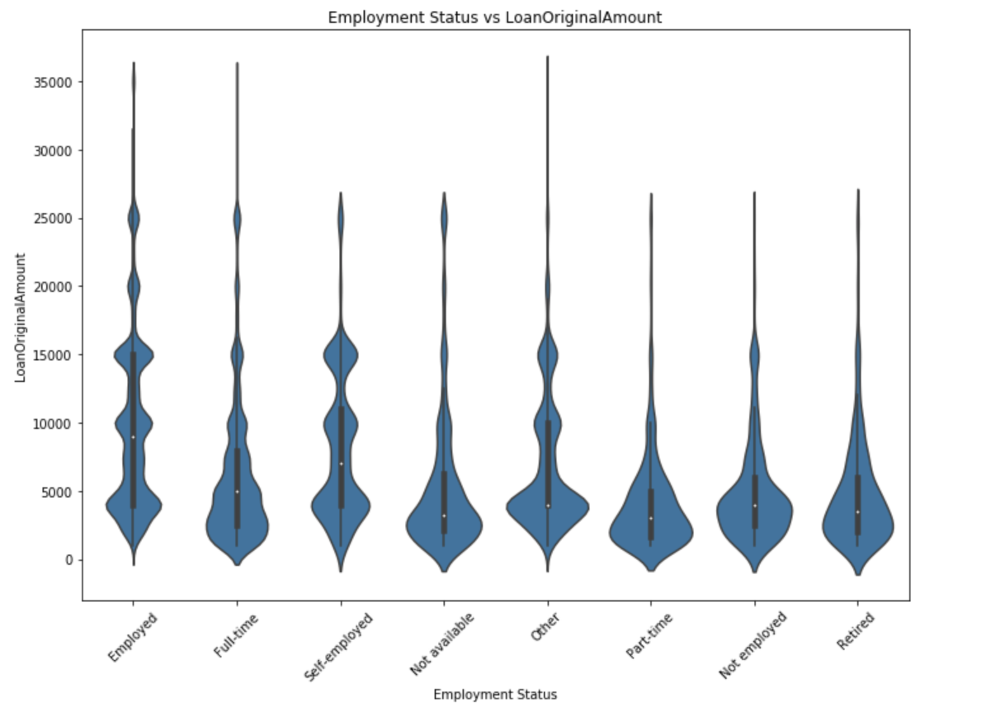
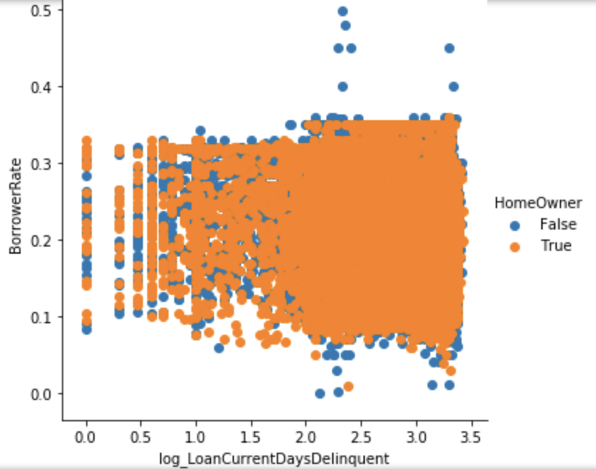

# Udacity-Data-Visualization

I've picked the `Loan Data from Prosper` dataset to perform my data exploration and visualization. 

Because the dataset is so huge, I will pick out the variables (columns) that I am interested in investigating from the dataset.

After reading through the dataset's data dictionary that explains each variables, and in order to answer the question and any further follow-up questions, I have pick the following variables from the dataset.

`IsBorrowerHomeowner`: A Borrower will be classified as a homowner if they have a mortgage on their credit profile or provide documentation confirming they are a homeowner.

`EmploymentStatus`: The employment status of the borrower at the time they posted the listing.

`IncomeRange`: The income range of the borrower at the time the listing was created.

`BorrowerRate`: The Borrower's interest rate for this loan. 

`LoanCurrentDaysDelinquent`: The number of days delinquent. 

`OnTimeProsperPayments`: Number of on time payments the borrower had made on Prosper loans at the time they created this listing. This value will be null if the borrower has no prior loans.

`LoanOriginalAmount`: The origination amount of the loan.

The primary question I want to investigate is **What affects the borrower’s interest rate?**

I was hoping to discover trends in these variables and see if they are at all affecting the rate.

First I plot out the frequency distribution of the borrower's rate. The plot is slightly skewed to the right with data concentrated at around 0.15, and it is multimodal when a second peak slightly over 0.3.
When I first saw the plot, my guess is that most people who are employed and has no loan delinquent will have the rate at around 15%, while unemployed borrowers or borrowers will many days of delinquent will have the rate averaged at 30%.

Naturally, I plot a barchat of rate frequency against employment status. It becomes obviously that individual without a job is highly unlike to obtain a rate at all, and most borrower are at least employed. 
Then plotting the rate frequency against the income range, I notice that getting a loan seems to have nothing to do with income level. There is no correlation between income level to tendency to getting a loan. 

After that, I plot a scatter graph between borrower's rate and number of delinquent loan. Now, I have to scale and take the log of the delinquent loan day because it is in the thousands. I anticipated that the higher the number of delinquent days, the higher the rate will be. However, the trend is not obvious enough to be confirmed by the graph. I am more surpised that there are many people will more than 2 days loan delinquent and are still able to obtain a rate.

Then, I create 2 violin plots of employment status vs rate, and income range vs rate. The range of all categories are similar, the median for the not-employed category is significantly higher. 
Staying on the not-employed category, more data is concentrated above the median proportionally and the frequency narrows down below the median.
For categories self-employed and employed, the frequency distribution is more even that not-employed and we see slightly higher distribution before the median. 

I also plot a graph of employment status against original loan amount. It is interesting to see that employed and full time employed individuals have highest top loan amount. The median of employed category is the highest as well.

Moving to the income Range vs rate graph, I once again trend of difference between not-employed category to the ones with income. I notice a slight trend that the lower the income range is positioned, the lower the median rate. 

Lastly, I plot a multivariate graph among the relationship of rate, loan delinquent day (log) and whether individual is a homeowner. However, I wasn't able to notice any trend in this plot except the outliners will high rate are not home owners.