# Udacity-Data-Visualization: Prosper Loan

Prosper is a P2P lending platform that allows investors to choose among personal loans to invest in. They do that by considering a number of factors, which include a custom calculated Prosper Score that represents the risk for each loan. The higher the score, the lower the risk, and the lower the interest rates paid by the borrower to the investors.

## Univariate Exploration

I will start by looking at the main variable of interest: `BorrowerRate`. 

### Employment Status:
The employment status of the borrower at the time they posted the listing.
The plot shows that it is rare that unemployed individual can obtain a loan from Prosper.

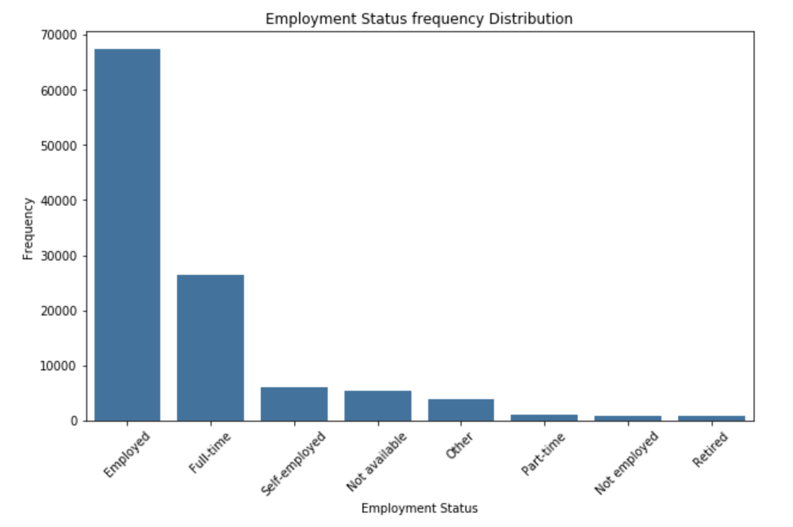

### Income Range:
The income range of the borrower at the time the listing was created.
The plot shows that most individual who has a loan has an income range from 25k to 75k.

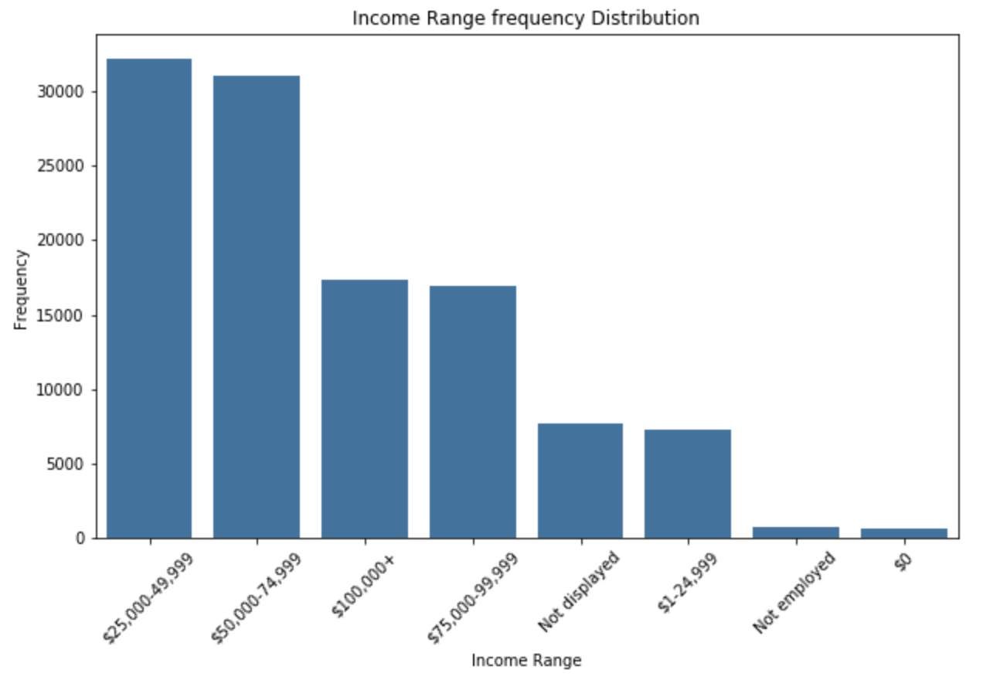

### Loan Status:
The current status of the loan: Cancelled,  Chargedoff, Completed, Current, Defaulted, FinalPaymentInProgress, PastDue. The PastDue status will be accompanied by a delinquency bucket.
The plot shows that more than 50,000 individuals has a loan with Prosper.

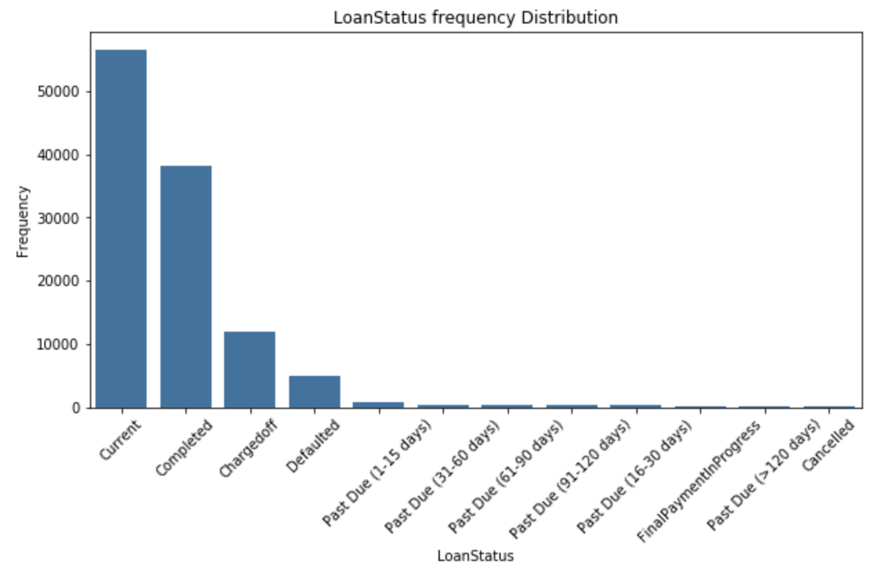

### Prosper Score:
A custom risk score built using historical Prosper data. The score ranges from 1-10, with 10 being the best, or lowest risk score.  Applicable for loans originated after July 2009.
The plot looks not to be skewed in any direction. 

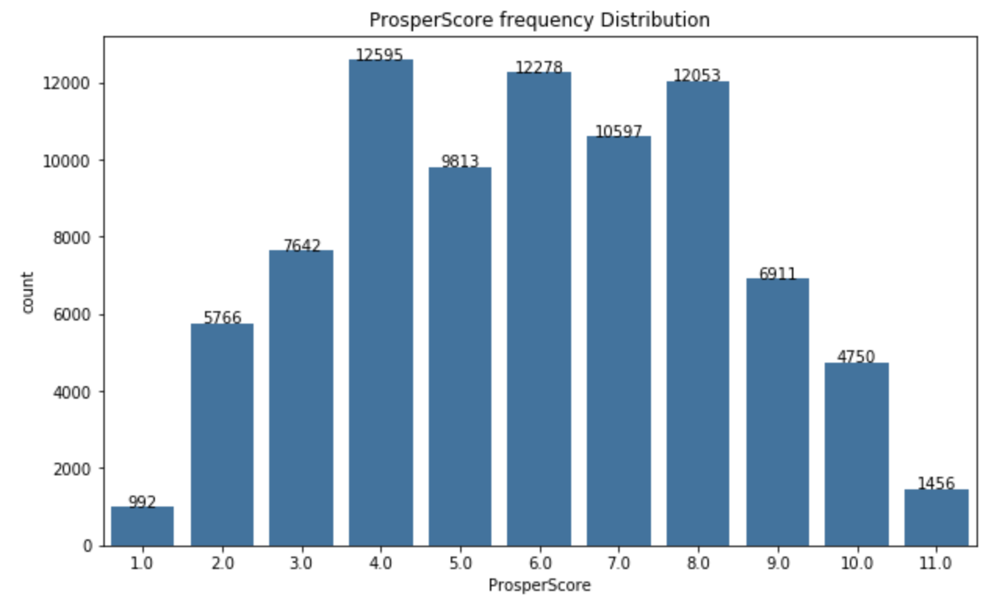

### Borrower APR:
The Borrower's Annual Percentage Rate (APR) for the loan.

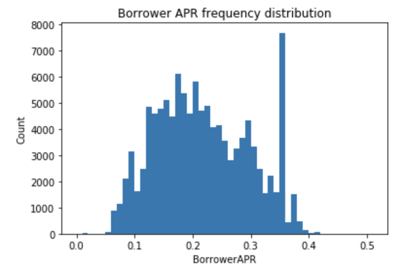

### BorrowerRate:
The Borrower's interest rate for this loan. 

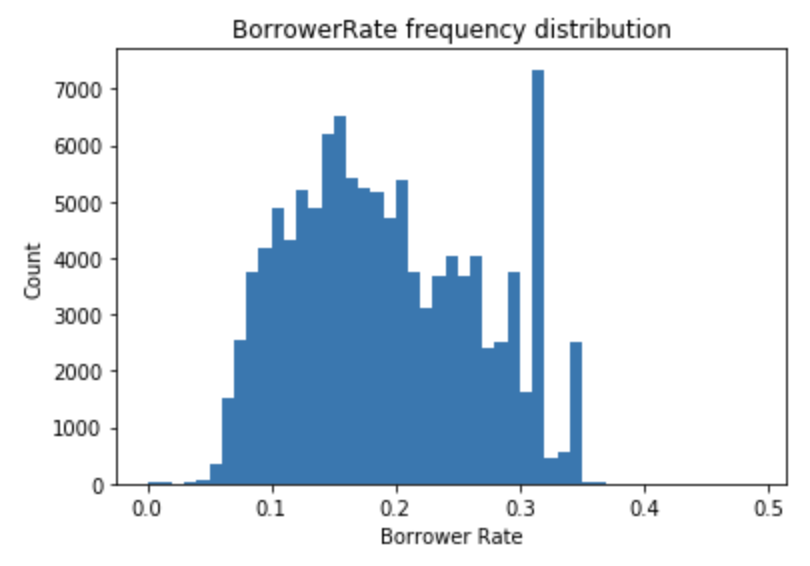

### MonthlyLoanPayment
It is the monthly payment made by the borrower.

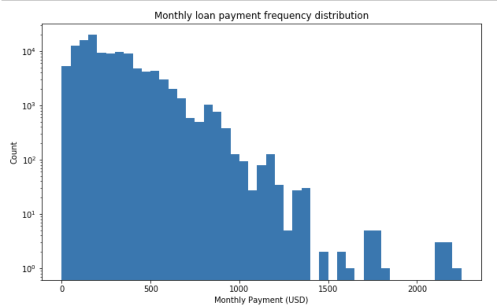

### Occupation
The Occupation selected by the Borrower at the time they created the listing.

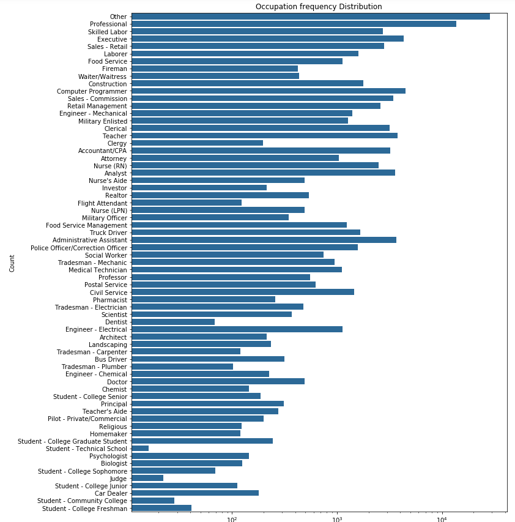

## Univariate Analysis
The main investigation interest is in the borrower's rate, both APR and rate. 
I learn from both plots range 0.1 - 0.4 while the APR plot is shifted more to the right 
of the rate. It is because APR is borrower's rate plus a late fee.

Another interesting variable is Prosper score. The plot found that most borrower's has
score range from  4 - 8. 

Other interesting variables include occupations, which we know that executive, computer programmer, Teacher and Adminstrative Assistant 
have the highest frequency, monthly loan payment and employment status.

It will definitely be very interesting to plot a bivariate plots of borrower rate against Prosper Rate, borrower rate against occupation.

## Bivariate Exploration
### Borrower vs. Employment status 
and 
### Borrower vs. Income Range

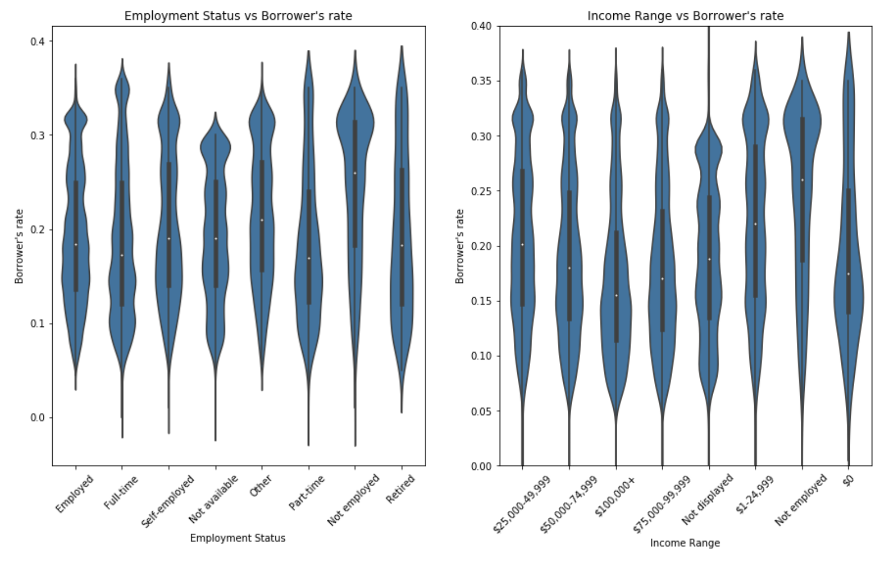

### Occupation against borrower's rate
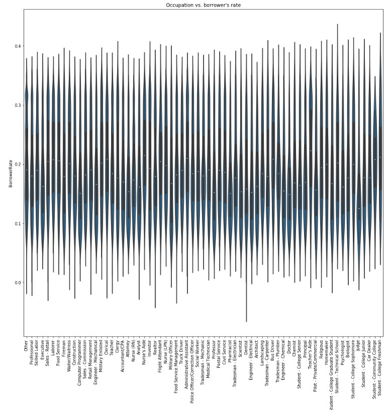
### Occupation against Monthly loan payment
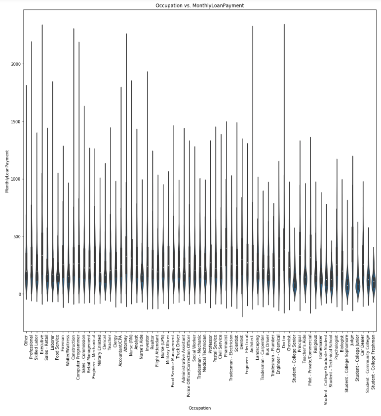

### Yearly Borrower Rates
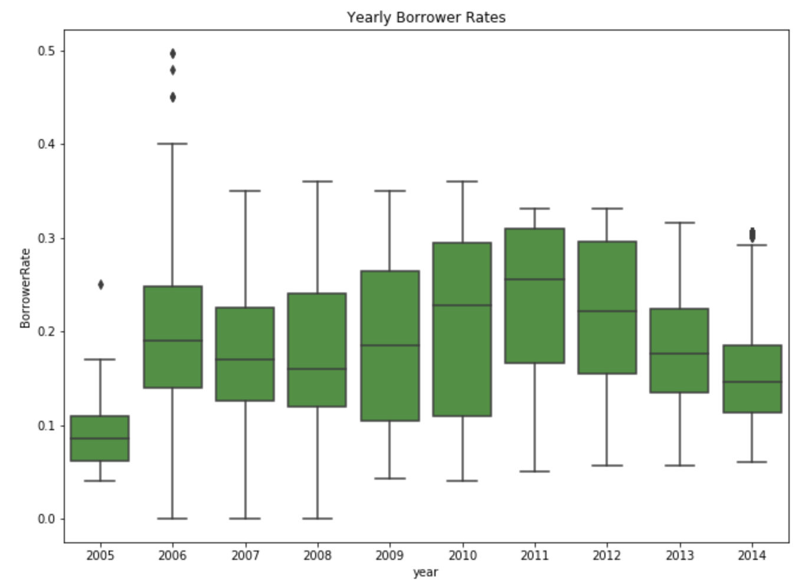

### Borrower rates vs. ProsperScore
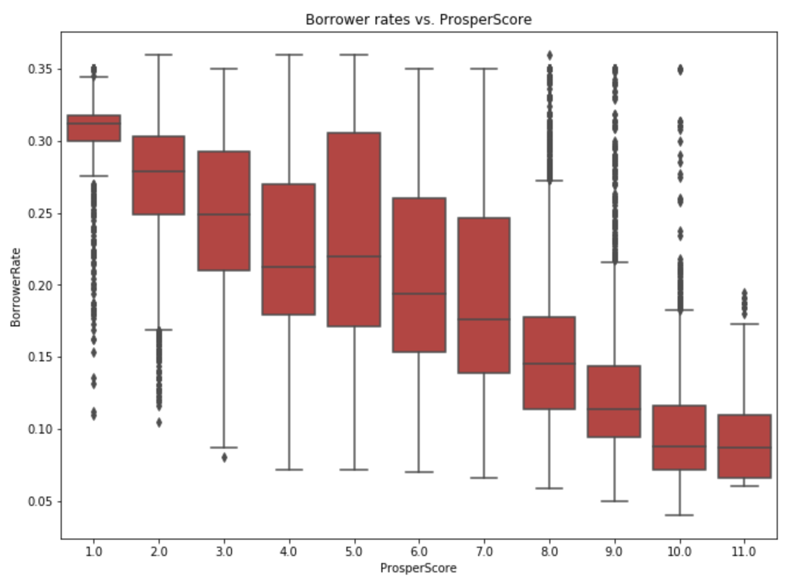

## Bivariate Analysis
I have created a new column named year to capture the year of the loan created. And I plot a graph of borrower rate by year and I discover interesting insight that
borrower rate has been decreasing still 2011.

The plot of borrower's rate against occupation shows that computer programmer, judge are two occupations that stand out to have lower median rate. 
Then I plot monthly loan payment against occupation and it shows that computer programmer, doctor and attorney have higher monthly payment.

The boxplot of borrower's rate against ProsperScore really gives a strong insight into a trend. The higher the prosperScore, the lower the borrower's rate. At 1.0 score, the rate is concentrated
at 3 - 3.5%. While the score will the most signifcant range is score 4.0 and 5.0. It has strong indication that prosperScore is one of the determining factor when evaluvating the borrower's rate.

## Multivariate Exploration
### Yearly Borrower rate vs. isHomeOwner
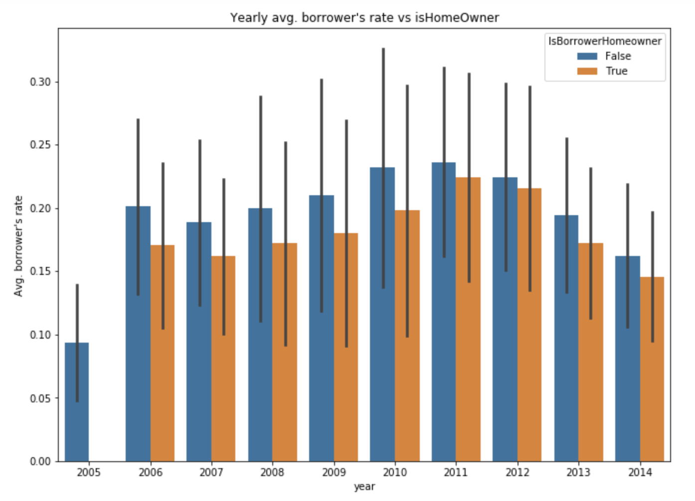

### Year borrower's rate vs. ProsperScore vs. isHomeOwner
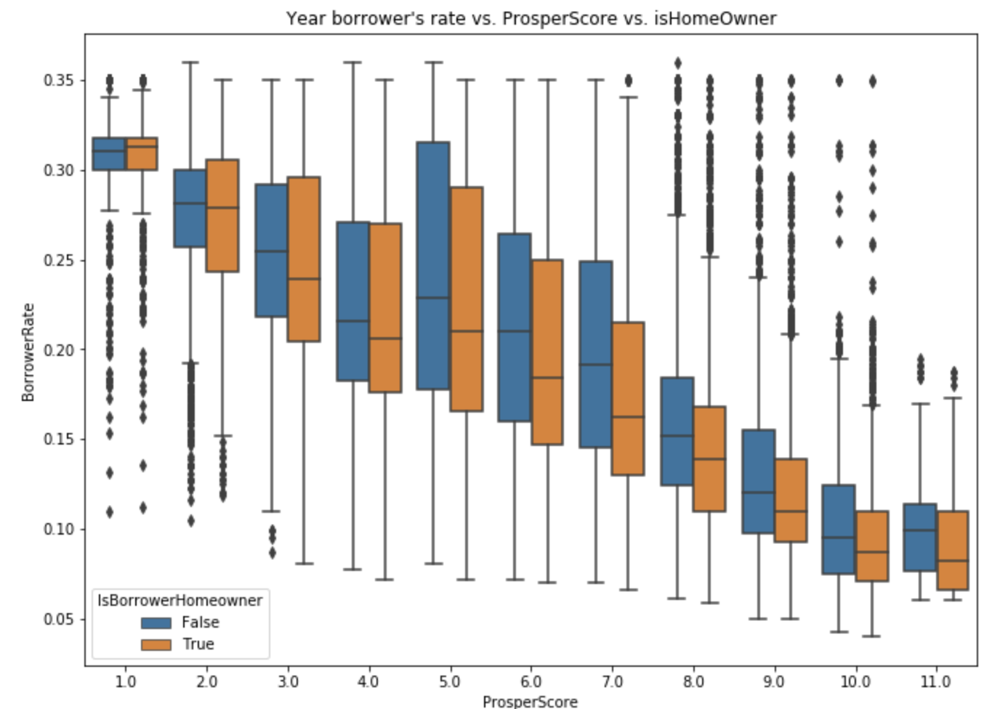

### Year borrower's rate vs. ProsperScore vs. IncomeRange
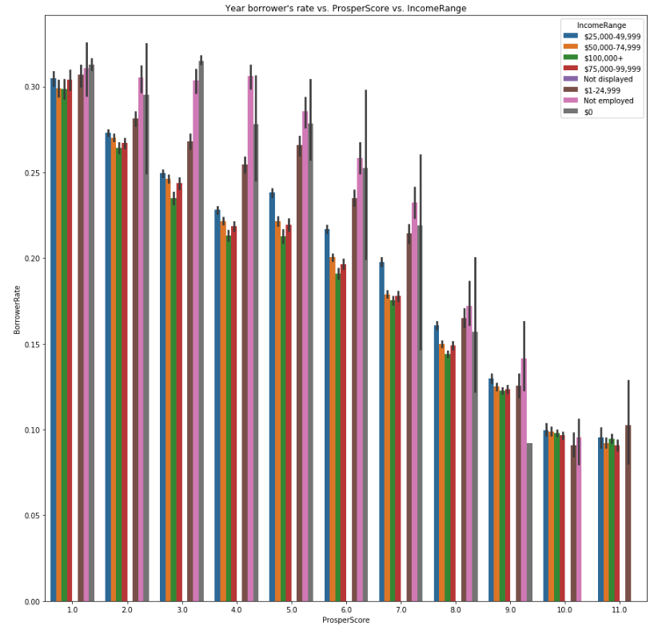

## Multivariate Analysis
The plot of avg. yearly borrower's rate vs isHomeowner shows that homeowners have higher rate than non-homeowners, and this is true for every year recorded in the dataset.
Then, I plot avg. borrower's rate vs. prosper score vs. isHomeowner, I notice that for score 5 or above, homeowners have higher rate, and for scores below 5, homeowners have similar or lower borrowing rate.
I plot a ProsperScore vs. Borrower's rate vs. income range, and it gives a clear indication that the higher the income, the lower the rate will be. As for those unemployed, the rate will be signficantly higher than those who are employed.